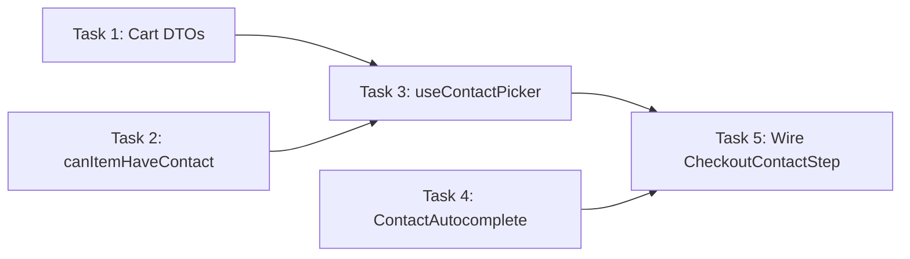

# Phase 3: Tasks

Decompose a design into small, ordered, verifiable development tasks — the final output of the architect pipeline.

This phase does what the original `breakdown` skill does, but consumes `requirements.md` + `design.md` instead of separate `prd.md` + `architecture.md`. It also adds a mandatory **grouping pass** to merge overly atomic tasks.

## Input

- `requirements.md` from the artifact folder (required)
- `design.md` from the artifact folder (required)
- `context-map.md` from the artifact folder (recommended)
- See `context-sources.md` for additional project documentation

## Output

- `tasks.md` saved to the artifact folder (see `formats.md` for template)

<HARD-GATE>
This is a READ-ONLY planning phase. Do NOT write any code or modify the codebase. The output is a task list document, not implementation.
</HARD-GATE>

## The Process

### Step 1: Load Upstream Artifacts

Read `requirements.md`, `design.md`, and optionally `context-map.md` from the artifact folder. If either required artifact is missing, tell the user which phase to run first.

Also check for project documentation listed in `context-sources.md` (`docs/ProjectStructure.md`). If available, use it to verify file paths and directory locations when writing tasks.

Extract:
- User stories and acceptance criteria (from requirements)
- Component list, dependency graph, and tech decisions (from design)
- Existing patterns and file paths (from context map)

### Step 2: Write the Overview and Task Graph

Before writing any task details, write the **overview section** of `tasks.md` — a one-sentence summary and a mermaid dependency graph showing all tasks and their connections.

Writing the graph first forces you to think about ordering, dependencies, and grouping before getting into details. It reveals:
- Which tasks are independent (parallelizable)
- Which tasks are too small to stand alone (groupable)
- Where the critical path is
- Circular dependencies (which means the breakdown is wrong)



This is a draft — it will be updated after the grouping pass (Step 6).

### Step 3: Map the Dependency Graph to Build Order

Use the dependency graph from the design document to determine bottom-up implementation order:

1. **Foundation first** — types, DTOs, shared utilities
2. **API layer next** — API client methods, new endpoints
3. **Logic layer** — composables, services, business rules
4. **UI layer** — components, views, templates
5. **Integration** — wiring components together, final plumbing
6. **Polish** — edge cases, error handling improvements, cleanup

High-risk items go early in their phase. Fail fast — discover problems before building on top of them.

### Step 4: Slice Vertically

Prefer vertical slices over horizontal layers. Each task should deliver a complete, testable piece of functionality:

**Bad (horizontal):**
```
Task 1: Create all DTOs
Task 2: Build all API methods
Task 3: Build all UI components
Task 4: Connect everything
```

**Good (vertical):**
```
Task 1: Add contact_id to cart DTOs and API layer
Task 2: Create useContactPicker composable with load + submit
Task 3: Build ContactAutocomplete wrapper component
Task 4: Wire CheckoutContactStep to composable and autocomplete
```

Each vertical slice leaves the system in a working, testable state.

### Step 5: Size Each Task

| Size | Files | Scope | Action |
|------|-------|-------|--------|
| **XS** | 1 | Single function or config change | Good to go |
| **S** | 1-2 | One component or endpoint | Good to go |
| **M** | 3-5 | One feature slice | Good to go |
| **L** | 5-8 | Multi-component feature | Consider splitting |
| **XL** | 8+ | Too large | Must split further |

Target S and M tasks. If a task is L or larger, break it into smaller tasks. No task should touch more than ~5 files.

### Step 6: Write Tasks

For each task, use this structure:

```markdown
### Task N: [Short descriptive title]
- **Covers:** US-001, US-003
- **Description:** [One paragraph — what this task accomplishes]
- **Acceptance Criteria:**
  - [ ] [Specific, testable condition]
  - [ ] [Specific, testable condition]
- **Verification:**
  - [ ] [How to confirm — test command, build check, manual verification]
- **Dependencies:** [Task numbers this depends on, or "None"]
- **Files:**
  - `[path/to/file]`
  - `[path/to/file]`
- **Size:** [XS / S / M / L]
```

Rules:
- **Covers** links to user stories from requirements — every task must trace to at least one
- Every task has acceptance criteria — no exceptions
- Every task has a verification step — how do you know it's done?
- Dependencies are explicit — no task depends on a task that comes later
- File paths are specific — not "somewhere in src/"
- Acceptance criteria are verifiable — never "works correctly" or "looks good"

### Step 7: Group Atomic Tasks (MANDATORY)

Review the task list for tasks that are too small to stand alone. This step is **mandatory** — never skip it.

**Merge when:**
- "Add field X to DTO A" + "Add field Y to DTO B" → merge if they serve the same feature step
- "Create helper function" + "Import helper in composable" → merge into a single task
- "Add import" + "Add prop" + "Wire event" → merge if they're for the same integration point
- Tasks that would never be done independently
- Tasks where doing one without the other leaves the codebase in a broken state

**Don't merge:**
- Tasks in different phases (e.g., API layer + UI component)
- Tasks that are individually testable and meaningful
- Tasks touching completely different files/concerns

After grouping, re-check sizes. If a merged task became L or XL, split it differently.

### Step 8: Group into Phases with Checkpoints

Organize tasks into phases. Add a checkpoint after every 2-3 tasks:

```markdown
## Phase 1: Foundation
- Task 1: ...
- Task 2: ...

### Checkpoint: Foundation
- [ ] All tests pass
- [ ] Application builds without errors
- [ ] Core types and API layer work
- [ ] Review before proceeding

## Phase 2: Core Logic
- Task 3: ...
- Task 4: ...

### Checkpoint: Core Logic
- [ ] Primary composable/service logic works
- [ ] Review before proceeding
```

Not all phase names are required. Use only what makes sense for the feature:
- **Foundation** — types, DTOs, API methods, utilities
- **Core Logic** — composables, state management
- **UI** — components, templates, styling
- **Integration** — wiring components together, final plumbing
- **Polish** — edge cases, error handling improvements, cleanup

Checkpoints are human review gates. The implementer should stop and verify before moving to the next phase.

### Step 9: Update the Task Graph

After grouping and phasing, update the mermaid diagram in the overview to reflect the final task structure. The graph written in Step 2 was a draft — now it should match the actual tasks.

### Step 10: Identify Parallelization Opportunities

Classify tasks:

- **Safe to parallelize:** Independent feature slices, tests for already-implemented features, documentation
- **Must be sequential:** Shared state changes, dependency chains, foundation → consumer
- **Needs coordination:** Tasks that share an API contract (define the contract first, then parallelize)

Include this classification in the task list document.

### Step 11: Document Risks

Carry over risks from the design document and add task-specific risks:

| Risk | Impact | Mitigation |
|------|--------|------------|
| [Risk] | [High/Med/Low] | [Strategy] |

### Step 12: Write and Save Task List

Write `tasks.md` to the artifact folder using the template from `formats.md`.

Present the task list to the user for review. Highlight:
- Total number of tasks and phases
- The task graph
- Estimated scope distribution (how many S, M, L tasks)
- High-risk tasks and when they're scheduled
- Parallelization opportunities

Apply requested changes, then save.

Announce and offer Phase 4:

> "Task list saved to `[path]/tasks.md`. [N tasks] across [N phases].
> Want me to compile tasks into standalone issue documents for an issue tracker?"

If user says yes → proceed to Phase 4 (see `references/phase-4-compile.md`).

## Common Rationalizations

| Rationalization | Reality |
|---|---|
| "I'll figure out the order as I go" | Wrong order means building on foundations that don't exist yet. 10 minutes of ordering saves hours. |
| "The tasks are obvious from the requirements" | Requirements define WHAT. Tasks define HOW MUCH per step, in WHAT ORDER, verified HOW. Different concerns. |
| "Planning is overhead" | Planning IS the task. Implementation without a plan is just typing with extra debugging. |
| "I can hold it all in my head" | Context is finite. Written task lists survive session boundaries, compaction, and team handoffs. |
| "Everything is high priority" | Dependency order defines the real priority. Build foundations first, not the most exciting feature. |
| "Small tasks are too granular" | Small tasks complete reliably. Large tasks produce tangled messes and partial progress. But too-small tasks waste time on context switching — that's why the grouping pass exists. |
| "Grouping pass is unnecessary" | Without it, you get tasks like "add import to file" that are meaningless alone and slow down implementation. |

## Red Flags

- Tasks without acceptance criteria
- Tasks without verification steps
- Tasks without `Covers:` — no traceability to requirements
- No task graph in the overview
- No dependency ordering — tasks listed randomly
- All tasks are L or XL sized
- All tasks are XS sized (no grouping pass done)
- No checkpoints between phases
- Horizontal slicing instead of vertical
- File paths missing or vague ("update the frontend")
- No parallelization classification
- Starting implementation without user reviewing the task list
- Skipping the grouping pass (Step 6)
- Tasks referencing components not in the design

## Verification

Before declaring the pipeline complete, confirm:

- [ ] All upstream artifacts loaded (requirements, design)
- [ ] Task graph written and reflects final task structure
- [ ] Every task has `Covers:` linking to user stories
- [ ] Every task has acceptance criteria
- [ ] Every task has a verification step
- [ ] Dependencies identified and ordered correctly
- [ ] No task touches more than ~5 files
- [ ] Most tasks are S or M sized
- [ ] Grouping pass completed (Step 6) — no standalone atomic tasks
- [ ] Phases with checkpoints every 2-3 tasks
- [ ] High-risk tasks scheduled early in their phase
- [ ] Parallelization opportunities classified
- [ ] Risks documented with mitigations
- [ ] User has reviewed and approved the task list
- [ ] `tasks.md` saved to artifact folder
- [ ] Phase 4 (compile) offered to user

## End of Pipeline

> "Pipeline complete. The artifact folder now contains:
> - `context-map.md` — codebase context (living document)
> - `requirements.md` — intent, user stories, questions log
> - `design.md` — architecture and technical design
> - `tasks.md` — [N tasks] in [N phases], ready for implementation
>
> Want me to compile tasks into standalone issue documents for an issue tracker?"
